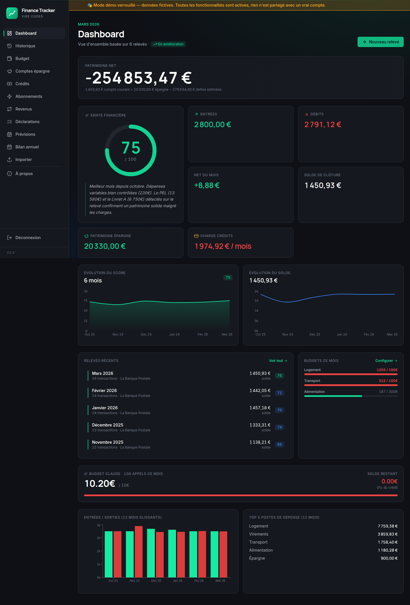
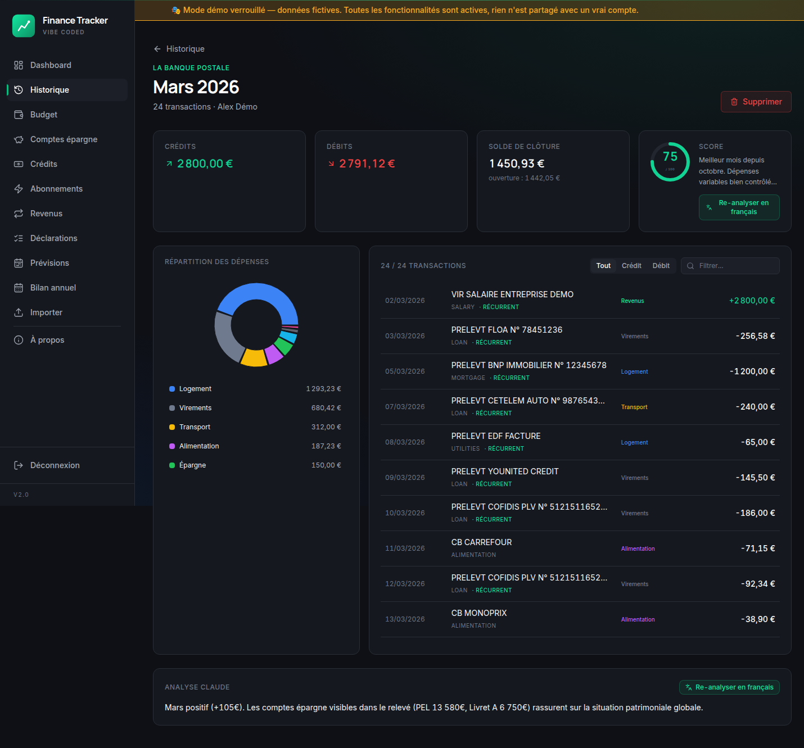
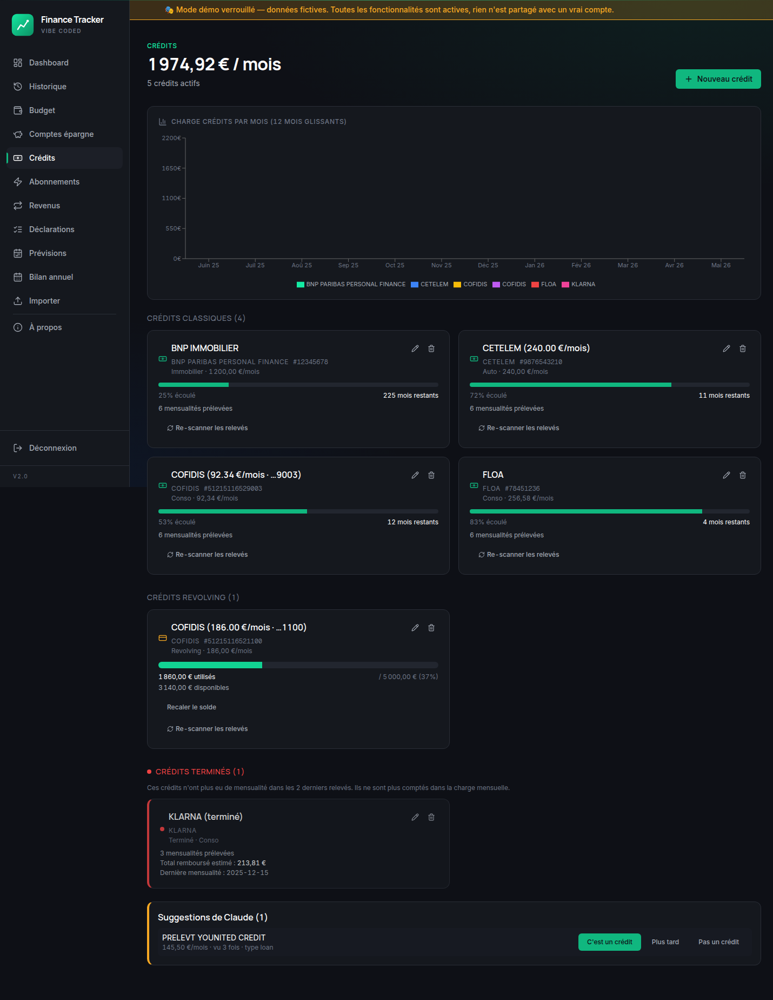
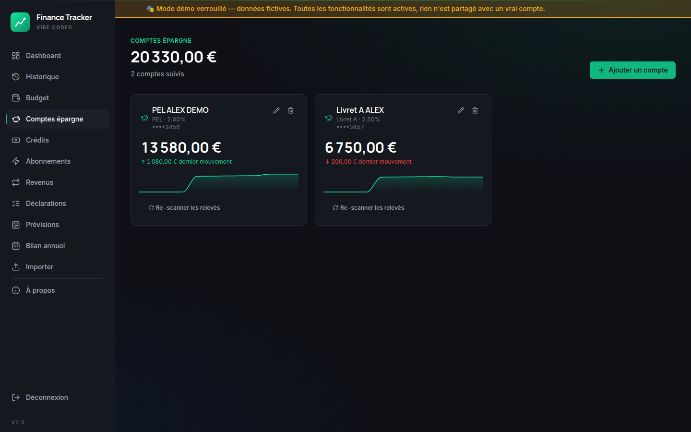
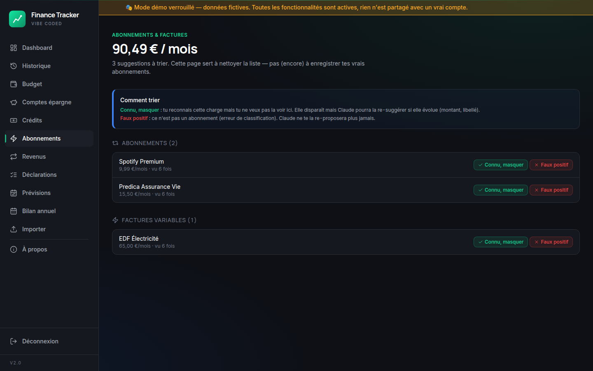
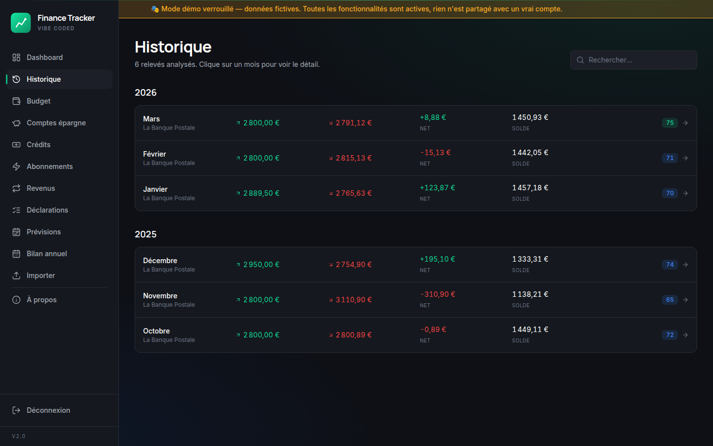
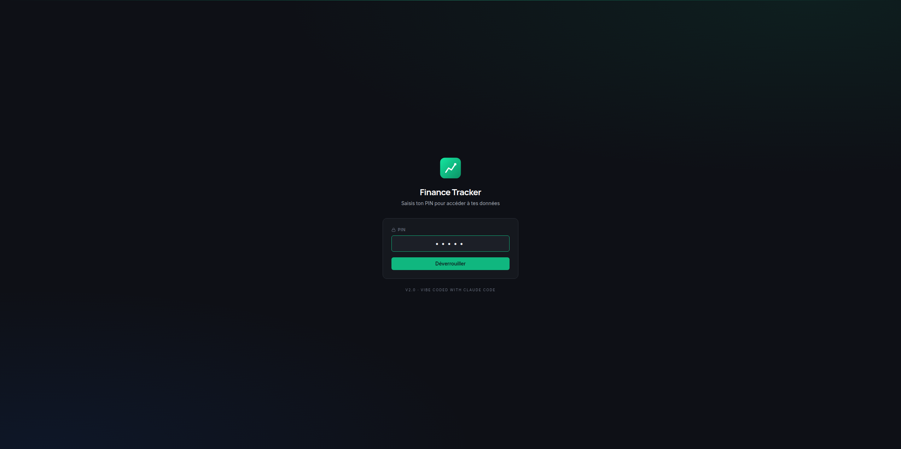

# Finance Tracker

[](https://claude.com/claude-code)
[](https://chat.openai.com)
[](https://react.dev)
[](https://nestjs.com)
[](LICENSE)

> Analyse tes relevés bancaires PDF avec Claude, suis ton score de santé financière, configure des budgets et des prévisions. Tout local, rien ne sort de ta machine.



> Captures prises en **mode démo** (jeu de données fictives 6 mois). L'app embarque un mode démo activable d'un clic, pour explorer toutes les fonctionnalités sans toucher à un vrai compte bancaire.

### Aperçu

| | |
|---|---|
|  |  |
| **Détail d'un relevé** — répartition catégorielle, transactions taggées + récurrentes, commentaire Claude | **Crédits** — classiques (barre temporelle), revolving (jauge), suggestions Claude à valider |
|  |  |
| **Comptes épargne** — PEL, Livret A, sparkline + recalage auto à chaque import | **Abonnements** — détectés par Claude, à trier (connu / faux positif) |
|  |  |
| **Historique** — relevés analysés groupés par année, score par mois | **Login** — PIN guard simple (Bearer token) pour les déploiements perso |

## Pourquoi

Dev Java/web depuis 2005, j'ai voulu voir jusqu'où on pouvait pousser une collaboration humain ⇄ IA sur un stack que je ne pratique pas en prod : **NestJS + React 18 + Tailwind + shadcn**. Cette appli a été co-construite avec [Claude Code](https://claude.com/claude-code) (le code) et [ChatGPT](https://chat.openai.com) (logo + premières maquettes UX).

Mon rôle : tracer la vision, valider les choix, repérer ce qui cloche.
Le rôle de Claude : poser le code, expliquer, itérer.

## Fonctionnalités

- **Import PDF multi-fichier** (jusqu'à 12 relevés en une fois) — analyse via Claude (Sonnet 4.5) en two-phase tool-use
- **Score de santé financière** sur 100 (5 dimensions : épargne, contrôle, dette, cash flow, irrégularité)
- **Catégorisation auto** des transactions (logement, alimentation, etc.) avec sous-catégorie + niveau de confiance
- **Détection des crédits récurrents** (salaire, loyers, pensions) avec date de fin estimée
- **Budgets par catégorie** — progression visuelle au fil du mois
- **Déclarations** d'engagements (revenus, crédits, abonnements) → moteur de **prévisions** mensuel
- **Bilan annuel** auto-archivé le 1er janvier (top catégories, meilleur/pire mois, score moyen)
- **Suivi conso Claude** partagé avec les autres apps (claude-shared.json)
- PIN guard simple en Bearer token

## Comment ça marche sous le capot

Curieux de savoir qui (toi / Claude / le backend) décide de quoi dans le pipeline d'analyse ? Le partage des rôles, les 5 dimensions du score déterministe, et l'historique des choix d'archi sont expliqués dans [**docs/HOW-IT-WORKS.md**](./docs/HOW-IT-WORKS.md).

## Stack

| Couche | Tech |
|---|---|
| Frontend | React 18 + TypeScript 5 + Vite 5 + Tailwind 3 + TanStack Router/Query + Recharts |
| Backend | NestJS 10 + TypeScript 5 + Anthropic SDK + Multer |
| Storage | JSON local (pas de DB) |
| Build | Docker multi-stage (node:20-alpine → nginx:alpine) |
| Déploiement | docker-compose (testé Synology NAS DSM) |

## Setup local

### Prérequis
- Docker 24+
- Une [clé API Anthropic](https://console.anthropic.com/settings/keys)

### Lancement
```bash
git clone <ce-repo> finance-tracker
cd finance-tracker

cp backend/.env.example backend/.env
# Édite backend/.env :
#   - APP_PIN (libre, 4-8 chiffres)
#   - ANTHROPIC_API_KEY (sk-ant-...)
#   - CORS_ORIGIN (l'URL où ton front sera servi)

# Crée les dossiers de données runtime
mkdir -p data/{uploads,statements,snapshots,yearly}
mkdir -p ../shared

# Build + run
docker compose up -d --build
```

Frontend disponible sur `http://localhost:4200`.
Backend API sur `http://localhost:3000/api/health`.

### Premier import
Va sur `/upload`, glisse un PDF de relevé (BNP, Société Générale, La Banque Postale, Crédit Agricole testés). L'analyse prend 30-60s par fichier.

## Sécurité / Vie privée

- **Aucune donnée envoyée ailleurs que vers Anthropic** (analyse PDF)
- Les relevés sont stockés en JSON dans `data/` (volume Docker monté)
- Le PIN protège l'accès web mais c'est du Bearer simple — l'app est conçue pour LAN/VPN, pas pour exposer à Internet
- Aucun secret dans le repo (`.env` gitignoré, seul `.env.example` est versionné)

## Crédits IA

- **[Claude Code](https://claude.com/claude-code)** (Anthropic) — code frontend, backend, infra Docker
- **[ChatGPT](https://chat.openai.com)** (OpenAI) — logo, premières maquettes UX, propositions de design

UI inspirée par [Stripe Dashboard](https://stripe.com), [Mercury](https://mercury.com), [shadcn/ui](https://ui.shadcn.com).
Principes UX : [refactoringui.com](https://refactoringui.com/), [lawsofux.com](https://lawsofux.com/).

## Licence

MIT — fais-en ce que tu veux.

---

**Si tu veux faire pareil** — prends un sujet qui t'enflamme, ouvre Claude Code, décris en langage naturel ce que tu rêves de voir exister, puis itère. Tu seras surpris de ce qu'on peut bâtir en quelques sessions.
